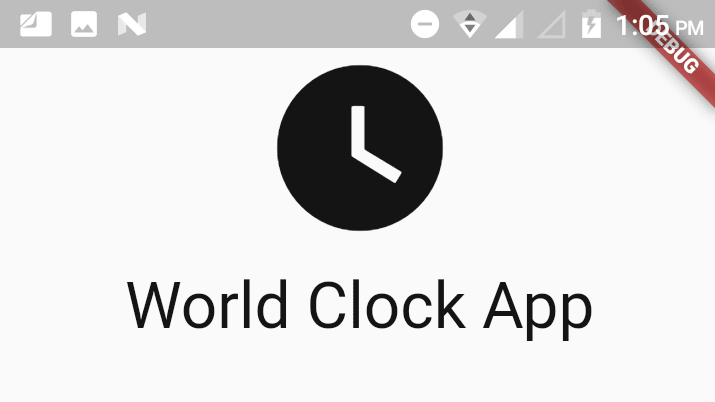
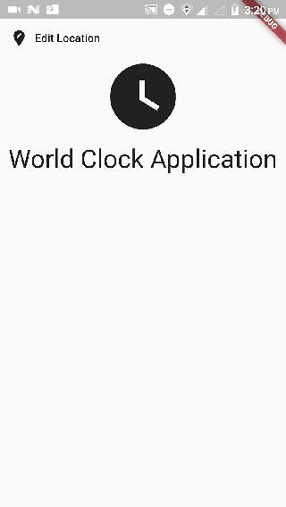

# WorldClock

A flutter project that displays world time ... 

## Getting Started
Flutter is an open-source UI software development kit created by Google. It is used to develop applications for Android, iOS, Linux, Mac, Windows, Google Fuchsia, and the web from a single codebase. The first version of Flutter was known as codename "Sky" and ran on the Android operating system.  

#### Creating a new project 
```shell
$ flutter create <project_name>
```
this will create a sample app...  
remove all the unnecessary codeblocks and initilize the blank application to get started.  

- initilize your project cleaning up all the unnecessary codebase using materail design ui, that looks like following screenshot.  


- create a basic layout for different routes you have. 
here, we have created **home, loading and chooseLocation** pages in [lib directory](https://github.com/aakritsubedi/World-Time-App/tree/master/lib).   
We can link the pages in main darts simply as passing the relative path or importing as a packages likewise in main file.
`import 'package:WorldClock/pages/home.dart';`

- adding a routes  
add a route to navigate between different routes to navigate between from routes.


- Flutter Packages  
Find the packages [here](https://pub.dev/packages/).

---
For help getting started with Flutter, view flutter
[online documentation](https://flutter.dev/docs), which offers tutorials,
samples, guidance on mobile development, and a full API reference.
